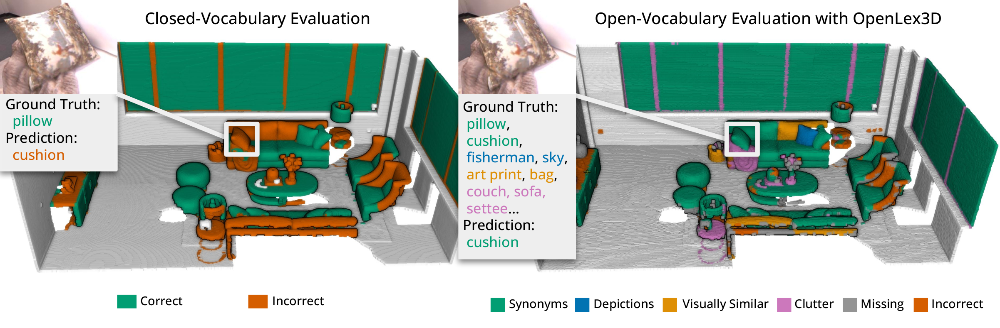

# OpenLex3D Toolbox
[**Project Page**](https://openlex3d.github.io/) |
[**ArXiv**](https://arxiv.org/abs/2503.19764)

[Christina Kassab*](https://ckassab.github.io/), [Sacha Morin*](https://sachamorin.github.io/), [Martin Büchner*](https://rl.uni-freiburg.de/people/buechner), [Matías Mattamala](https://mmattamala.github.io/), [Kumaraditya Gupta](https://www.kumaradityag.com/), [Abhinav Valada](https://rl.uni-freiburg.de/people/valada), [Liam Paull](https://liampaull.ca/), [Maurice Fallon](https://ori.ox.ac.uk/people/maurice-fallon/)


<p align="center">
	
</p>
Scripts and other tools for the OpenLex3D Benchmark.

## Setup

### For GPU
```sh
pip install openlex3d[gpu]
```

### For CPU
```sh
pip install openlex3d[cpu]
```

### For Development
Assuming GPU access
```sh
conda create -n openlex3d-env python=3.11
pip install -e .[gpu]
pre-commit install
```

### Update Paths
All dataset and evaluation paths are configured in `openlex/config/paths.yaml`. As you set up this repository, update `paths.yaml` with your own paths. All `*_path` variables in this README refer to a key in `paths.yaml`.

### OpenLex3D Ground Truth
The OpenLex3D ground truth labels can be downloaded from [here](https://drive.google.com/file/d/1NHVmWS9gtkhOO6c09s2OWnMurMUgUSSn/view?usp=sharing). Extract them to `openlex_gt_path`.

### Datasets
#### Replica
For predictions, methods should use the trajectories from Nice-SLAM. A download script is available [here](https://github.com/cvg/nice-slam/blob/master/scripts/download_replica.sh). 

For computing the metrics, you need to download the [original Replica assets](https://github.com/facebookresearch/Replica-Dataset) and save them to `replica_path`.
#### ScanNet++
In order to download the data, create an account and application [here](https://kaldir.vc.in.tum.de/scannetpp/). Download scenes 0a76e06478,  0a7cc12c0e,  1f7cbbdde1,  49a82360aa,  4c5c60fa76,  8a35ef3cfe,  c0f5742640 and  fd361ab85f to `scannetpp_path`.

For predictions, methods should use the iPhone RGB-D images and COLMAP poses. 

For computing the metrics, we use a script provided in the [ScanNet++ toolbox](https://github.com/scannetpp/scannetpp) to sample points on the ground truth mesh. Run the following and save the outputs to a folder called prepared_semantics in `scannetpp_path`:
```sh
python -m semantic.prep.prepare_training_data semantic/configs/prepare_training_data.yml
```

#### Habitat Matterport
TODO: MARTIN CONFIRM THIS

Follow the [HOV-SG](https://github.com/hovsg/HOV-SG) instructions to collect walks for scenes 00824, 00829, 00843, 00847, 00873, 00877 and 00890. Save each walk as a subdirectory in `hm3d_path` using the scene number as the name (e.g., `hm3d_path/00824`).

## Predictions
Predictions should be stored in as three files:

```bash
embeddings.npy # (n_objects, n_dim) numpy array with object features
index.npy # (n_points,) numpy array of point to object correspondences. embeddings[index[i]] should give the features of the ith point in point_cloud.pcd
point_cloud.pcd # RGB point cloud with n_points
```

For dense methods, `index.npy` will simply be `np.arange(n_points)`.

You can [download](https://drive.google.com/file/d/1jY_lrci-ytBCbOhEgHSDnHP7q5zjXOe5/view?usp=sharing) sample predictions in the OpenLex3D format for `bare`, `concept-graphs` and `openmask3d`. Extract them to `base_prediction_path`.

## Running the Evaluation Script

### Segmentation IoU
To compute the top1 IoU metric for a method called `bare` on the `office0` scene of the Replica dataset using a GPU, you can use
```sh
python openlex3d/scripts/evaluate_segmentation.py -cp <absolute to the openlex3d/config folder> -cn eval_segmentation evaluation.algorithm=bare dataset=segmentation/replica dataset.scene=office0 evaluation.topn=1 model.device=cuda:0
```
By default, the script will look for predictions at `base_prediction_path/bare/replica/office0` with `base_prediction_path` being defined in `paths.yaml`. You can instead provide your own prediction path by adding `evaluation.predictions_path=<custom path to scene predictions>` to your command.

The dataset options are `segmentation/replica`, `segmentation/scannetpp` and `segmentation/hm3d`. In this example, results will be saved to `output_path/bare/top_1/replica/office0` where `output_path` is again taken from `paths.yaml`.

You can alternatively use the installed script `ol3_evaluate_segmentation` with the same arguments.

```sh
ol3_evaluate_segmentation -cp <absolute to the openlex3d/config folder> -cn eval_segmentation evaluation.algorithm=bare dataset=segmentation/replica dataset.scene=office0 evaluation.topn=1 model.device=cuda:0
```

You can use the hydra **multirun** function to sequentially process multiple scenes and top n.
```sh
ol3_evaluate_segmentation -m -cp <absolute to the openlex3d/config folder> -cn eval_segmentation evaluation.algorithm=bare dataset=segmentation/replica dataset.scene=office0,office1 evaluation.topn=1,5 model.device=cuda:0
```

### Segmentation Set Ranking
Add `evaluation.set_ranking=true` to the previous commands.

### Queries
To compute AP metrics for all the queries for a method called `bare` on the Replica dataset using a GPU, you can use
```sh
python openlex3d/scripts/evaluate_queries.py -cp <absolute to the openlex3d/config folder> -cn eval_queries evaluation.algorithm=bare evaluation.query_level=all dataset=query/replica evaluation.top_k=10 model.device=cuda:0
```
By default, the script will look for predictions at `base_prediction_path/bare/replica/<scene_id>` with `base_prediction_path` being defined in `paths.yaml`. You can instead provide your own prediction path by adding `evaluation.predictions_path=<custom path to dataset predictions>` to your command.

The dataset options are `query/replica`, `query/scannetpp` and `query/hm3d`. The query AP metrics will be computed on all the scenes supported by OpenLex3D for that dataset. The per-scene results will also be saved.

You can alternatively use the installed script `ol3_evaluate_queries` with the same arguments.
```sh
ol3_evaluate_queries -m -cp <absolute to the openlex3d/config folder> -cn eval_queries evaluation.algorithm=bare evaluation.query_level=all dataset=query/replica evaluation.top_k=10 model.device=cuda:0
```

To get a summary of the results, you can run
```sh
python openlex3d/scripts/postprocessing/generate_queries_csv.py <path to output_path used to run queries evaluation>
```
This will save two CSV files with the overall and per-scene metrics to `output_path/query_results_overall.csv` and `output_path/query_results_per_scene.csv` respectively.

## Visualizer
### Segmentation
The `visualize_results.py` will visualize category predictions using open3d. Assuming we ran the command from the Segmentation IoU section, you can use
```sh
python openlex3d/visualization/visualize_results.py output_path/bare/top_1/replica/office0
```
and follow terminal instructions to visualize label predictions for specific point clouds.

### Queries
The `visualize_queries.py` will visualize the predictions for specified queries in a scene using open3d. Assuming we ran the command from the Queries section above, you can use
```sh
python openlex3d/visualization/visualize_queries.py output_path/viz/all/replica/office0/bare
```
and follow terminal instructions.

# Reference
If you find OpenLex3D useful, please leave a ⭐ and consider citing our [arXiv preprint](https://arxiv.org/abs/2503.19764):
```
@article{kassab2025openlex3d,
  title={OpenLex3D: A New Evaluation Benchmark for Open-Vocabulary 3D Scene Representations},
  author={Kassab, Christina and Morin, Sacha and B{\"u}chner, Martin and Mattamala, Mat{\'\i}as and Gupta, Kumaraditya and Valada, Abhinav and Paull, Liam and Fallon, Maurice},
  journal={arXiv preprint arXiv:2503.19764},
  year={2025}
}
```
